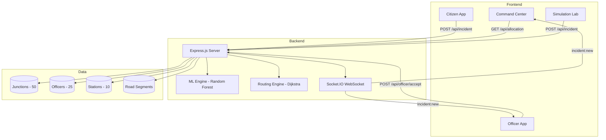

# NGP-TRAFFIC &#128680;

**AI-Powered Traffic Risk Heatmap & Smart Police Deployment System for Nagpur City**

[](https://nodejs.org)
[](https://expressjs.com)
[](https://socket.io)
[](https://en.wikipedia.org/wiki/Random_forest)
[](LICENSE)
[](#testing)

> A real-time, ML-driven traffic risk prediction and police officer deployment optimization system built for the Nagpur Municipal region. Features a trained Random Forest model, Dijkstra routing engine, real-time WebSocket sync, and a complete 3-app ecosystem.

---

## &#127919; Problem Statement

Indian cities like Nagpur face escalating traffic incidents, with limited police personnel deployed using manual, experience-based methods. This leads to:
- **Reactive policing** — officers respond after incidents, not before
- **Uneven coverage** — some high-risk junctions left unmonitored
- **Slow response times** — no data-driven dispatch routing

**NGP-TRAFFIC** solves this with a **predictive, AI-optimized** deployment system.

---

## &#128640; Features

### &#129302; Machine Learning Risk Engine
- **Random Forest** ensemble (10 trees, max_depth=8) trained on synthetic Nagpur junction data
- **13 feature vectors**: hour, day_of_week, rain, road_type, accident_history, speed_limit, school/hospital zones, pedestrian density, lane count, signal presence, traffic volume, live incidents
- **Hybrid scoring**: 60% ML prediction + 40% heuristic (robust and explainable)
- **Full model metrics**: R&#178;, RMSE, Accuracy, F1-Score, Feature Importance (SHAP-style permutation), Predicted vs Actual curve

### &#128506; 3-App Ecosystem
| App | URL | Purpose |
|-----|-----|---------|
| **Command Center** | `/` | Real-time risk heatmap, AI deployment, historical playback, ML analytics |
| **Citizen App** | `/citizen.html` | Mobile-first incident reporting with geolocation and severity tagging |
| **Officer App** | `/officer.html` | Field dispatch terminal with accept/arrive/resolve workflow and route map |
| **Simulation Lab** | `/simulation.html` | Demo environment for testing scenarios and preset incidents |

### &#9889; Real-Time Architecture
- **Socket.IO** bidirectional sync across all apps
- Citizen reports &#10132; Command Center alert &#10132; Officer dispatch in <1 second
- Live incident feed, officer status updates, deployment recalculations

### &#128739; Routing & Dispatch Engine
- **Dijkstra shortest-path** over Nagpur road network graph
- Calculates officer-to-junction **ETA** in minutes
- Nearest station finder with sorted results
- Route visualization on officer's map

### &#128202; Analytics Dashboard
- 50 road-snapped Nagpur junctions with 24-hour traffic profiles
- Risk heatmap with high/medium/low classification
- Baseline vs AI-optimized deployment comparison
- Historical mode with past-only timeline
- Per-junction explainability breakdown

---

## &#128736; Architecture



---

## &#128187; Quick Start

```bash
# Clone
git clone https://github.com/Pranavdeshmukhhh/ngp-traffic.git
cd ngp-traffic

# Install
npm install

# Start (ML model trains on startup ~30s)
npm start

# Open browser
# Command Center:  http://localhost:3000
# Citizen App:     http://localhost:3000/citizen.html
# Officer App:     http://localhost:3000/officer.html
# Simulation Lab:  http://localhost:3000/simulation.html
```

---

## &#128203; API Reference

| Method | Endpoint | Description |
|--------|----------|-------------|
| GET | `/api/allocation?hour=18&officers=25` | Get risk-scored junctions + AI deployment |
| GET | `/api/ml/metrics` | ML model metrics, feature importance, PvA curve |
| GET | `/api/route?from=J001&to=J010` | Dijkstra shortest path + ETA |
| GET | `/api/nearest-station?junction=J001` | Nearest 3 police stations by ETA |
| GET | `/api/junctions` | All 50 junction data |
| GET | `/api/stations` | All 10 police stations |
| GET | `/api/officers` | All 25 officers |
| GET | `/api/risk-scores?hour=18` | Risk scores for all junctions |
| POST | `/api/incident` | Report new incident (triggers WebSocket broadcast) |
| POST | `/api/incident/resolve` | Resolve an incident |
| POST | `/api/officer/accept` | Officer accepts dispatch |
| POST | `/api/officer/arrived` | Officer marks arrival |

### WebSocket Events
| Event | Direction | Payload |
|-------|-----------|---------|
| `incident:new` | Server &#10132; Client | Incident + dispatch info + redeployment |
| `incident:resolved` | Server &#10132; Client | Incident ID + updated active list |
| `deployment:update` | Server &#10132; Client | New deployment + junctions |
| `officer:status` | Server &#10132; Client | Officer ID + status change |

---

## &#128295; Testing

```bash
npm test
```

Tests cover:
- &#9989; Data integrity (50 junctions, 25 officers, 10 stations)
- &#9989; ML feature extraction and normalization
- &#9989; ML model training, prediction bounds, metrics validation
- &#9989; Dijkstra routing + ETA reasonableness
- &#9989; Allocation edge cases (0 officers, overloaded)
- &#9989; API response structure validation

---

## &#128230; Deployment

### Docker
```bash
docker build -t ngp-traffic .
docker run -p 3000:3000 ngp-traffic
```

### Render (1-click)
Push to GitHub and connect to [Render](https://render.com). The `render.yaml` auto-configures everything.

---

## &#128218; Tech Stack

| Layer | Technology |
|-------|-----------|
| Backend | Node.js, Express.js |
| ML Engine | Custom Random Forest (pure JS, no Python dependency) |
| Routing | Dijkstra shortest-path algorithm |
| Real-time | Socket.IO (WebSocket) |
| Frontend | HTML5, CSS3, Vanilla JS |
| Maps | Leaflet.js + OpenStreetMap |
| Charts | Chart.js |
| Deployment | Docker, Render |

---

## &#128101; Team

**Team NGP-TRAFFIC** — Built for National Level Hackathon

---

## &#128196; License

MIT License